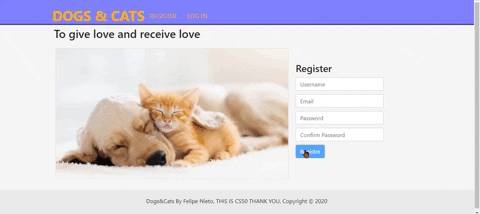
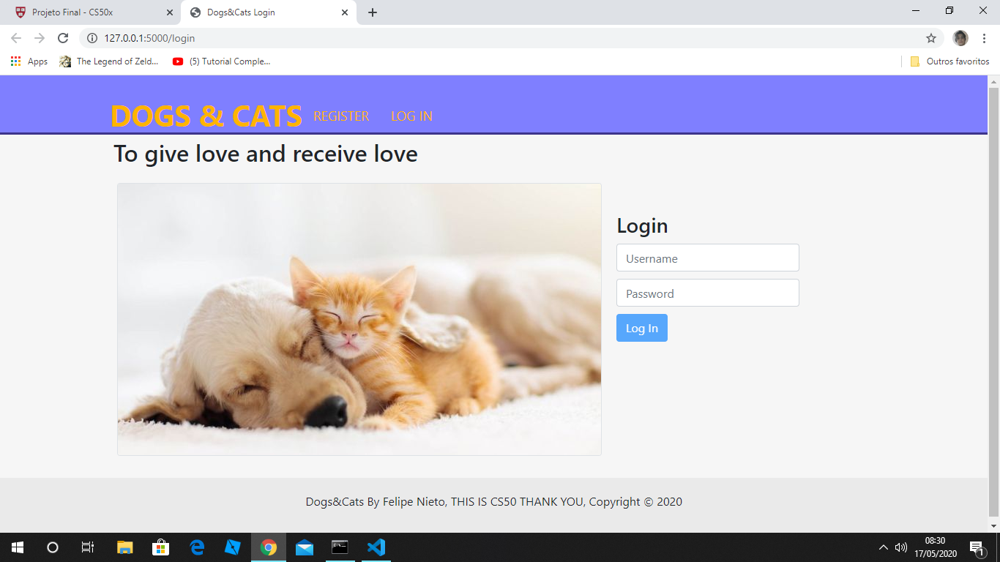
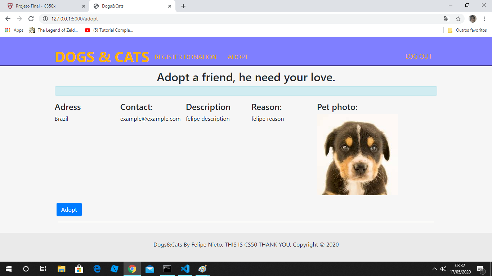
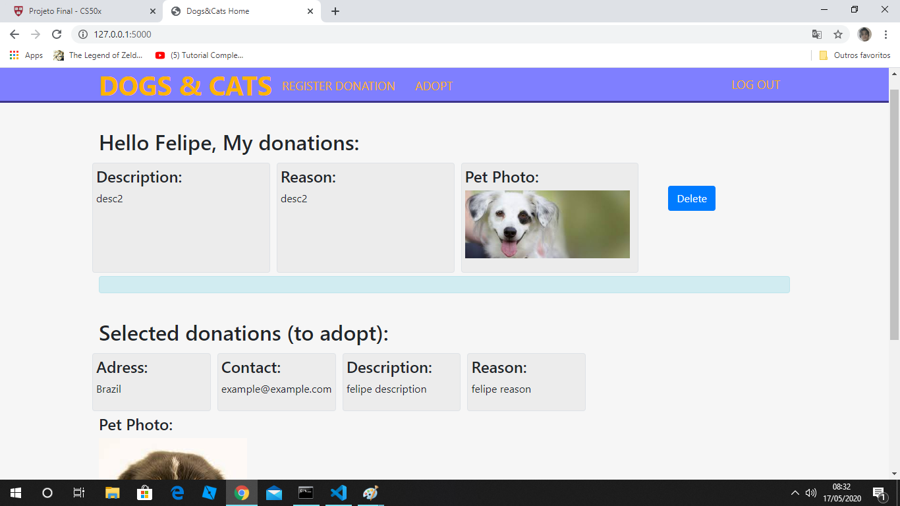
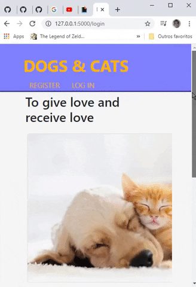

# DOGS&CATS

## CS50
>This was my final project for conclude the CS50 Introduction to Computer Sciense course.

>CS, python, flask, flask web framework, web development, CS50
## Features

- [Flask-SQLAlchemy](https://flask-sqlalchemy.palletsprojects.com/en/2.x/)
- [Flask](https://flask.palletsprojects.com/en/1.1.x/)
- [Flask-WTF](https://flask-wtf.readthedocs.io/en/stable/index.html)

I've used Flask web framework based in Python
its was necessary flask-sqlalchemy for manage SQL database with sqlite and flask-wtf for upload files and forms extensions

## Explaining the project and the database
My final project is a website that allow the user register donation of pets and
get donation from the others people (adopt). The user can also delete your register, see
your registers and selected donations to adopt a pet from de other people

All information about users, cases and selected cases for each people are stored in dogscats.db.

I used sqlalchemy extension for connect the database to application and sqlite3 to manager her.

### Sqlachemy and sqlite3:
I needed three tables for my database:

- First, table users. Where I put, id, username, hash (for password) and email, notice that id must be a primary key here.

- Second, table cases. I put person_id, case_id, adress, email (could have referenced the users table), description, reason, photo. In photo I store the filename of the image, and in my filesystem I store all images that were uploads with flask-wtf extension. Notice that here person_id must be a foreign key.

- Three, table selectedcases, this table is for store the relationship between persons and cases, one person might have many cases likewise one case might have many peoples interested

### Storing images of your pets and validations.
The input field of images have a single validate, my database have a filename field in a table and I upload this image with flask-wtf extension to my filesystem, then I have to validate each name file for don't overwrite the images with same name.

```python
filename = secure_filename(f.filename)
            name = cases.select(cases.columns.filename == filename).execute()
            name = name.fetchall()
            print(name)
            if name != []:
                # is the same folder for all users, so in this way, I will able to avoid overwrite images
                error = "Filename already exist! Must be different, please rename the file (e.g, name_something)"
                flash(error)
                return redirect("/MyDonation")
            # print(type(filename)) str
            f.save(os.path.join(f"static/images/users/", filename))
``` 

if I don't select any file, I get a default image 

```python
filename = "default.jpg"
db.execute("INSERT INTO cases (person_id, adress, email, description, reason, filename) VALUES (:person, :ad, :em, :des, :rea, :file)",
person=user, ad=adress, em=email, des=desc, rea=reason, file=filename)
return redirect("/")
```

Validations for username, password, etc:


## Pictures
- Login and Adopt page

| Login | Adopt |
| :---: | :---: |
|   | |

- Homepage and Responsive show case

| Homepage | Responsive Web |
| :---: | :---: | 
|  | 


## Demonstration on youtube
For the CS50 final project you have to make a video showning your project,
[My Final Project presentation](https://www.youtube.com/watch?v=YAXmRfrcOVc)

## Documentation
https://flask.palletsprojects.com/en/1.1.x/

https://flask-sqlalchemy.palletsprojects.com/en/2.x/

https://flask-wtf.readthedocs.io/en/stable/form.html#module-flask_wtf.file

## About CS50
CS50 is a openware course from Havard University and taught by David J. Malan

Introduction to the intellectual enterprises of computer science and the art of programming. This course teaches students how to think algorithmically and solve problems efficiently. Topics include abstraction, algorithms, data structures, encapsulation, resource management, security, and software engineering. Languages include C, Python, and SQL plus students’ choice of: HTML, CSS, and JavaScript (for web development).

Thank you for all CS50.

- Where I get CS50 course?
https://cs50.harvard.edu/x/2020/

[LinkedIn Felipe Nieto](https://www.linkedin.com/in/felipe-antonio-nieto-curcio-9b865116a/)
